# Encryptify

Encrypts or decrypts whole directories with a single key from `.env`.
</br>
No fluff, just streams, tasks, and a byte-shift cipher that works.

> *Built as a learning project to explore file I/O, task queues, and basic cryptography in C++.*


## What it does

* Recursively scans a directory
* Queues each file as a task
* **Encrypt** → `(byte + key) % 256`
* **Decrypt** → `(byte - key + 256) % 256`
* Key is read straight from `.env`
* Files are modified **in-place**


## Algorithm

The cipher is a simple **Caesar shift over raw bytes (0–255)**:

* Let `b` be a byte, `k` the integer key from `.env`.
* Encryption: `b' = (b + k) % 256`
* Decryption: `b' = (b - key + 256) % 256`

Properties:

* **Invertible** → decrypt(encrypt(b)) = b
* **In-place** → same file, no temp copies
* **Complexity** → O(N) per file, O(1) memory

On success, every processed file is rewritten in-place and the program returns `0`.


## Diagrams

### ⚙️ Algorithm (per byte)


### 📦 Sequence (batch run)

```mermaid
sequenceDiagram
    participant User
    participant Main
    participant PM as ProcessManagement
    participant Task
    participant Cryption
    participant Env as ReadEnv
    participant File as fstream

    User->>Main: run ./encryptify
    Main->>PM: submit Task(file, action)
    PM->>Task: enqueue
    Main->>PM: executeTasks()
    loop until queue empty
        PM->>Task: pop
        PM->>Cryption: executeCryption(taskData)
        Cryption->>Env: load key from .env
        Cryption->>File: open file stream
        Cryption->>File: byte-wise shift (± key mod 256)
        File-->>Cryption: updated in-place
    end
    PM-->>Main: return 0
```




## Usage

```bash
# build
g++ -std=c++20 -O2 -o encryptify main.cpp \
  src/app/processes/ProcessManagement.cpp \
  src/app/encryptDecrypt/Cryption.cpp \
  src/app/fileHandling/IO.cpp

# set key
echo "42" > .env

# run
./encryptify
# enter directory path + action (encrypt/decrypt)
```


## Layout

```
/processes      -> Task + queue runner
/encryptDecrypt -> executeCryption()
/fileHandling   -> IO + env reader
main.cpp        -> CLI entry
```


## Demo Run

```bash
$ ./encryptify
Enter the directory path: ./demo_files
Enter the action (encrypt/decrypt): encrypt
Executing task: ./demo_files/secret.txt,ENCRYPT
Executing task: ./demo_files/config.json,ENCRYPT
Executing task: ./demo_files/image.png,ENCRYPT
...
Done.
```

Now decrypt the same folder:

```bash
$ ./encryptify
Enter the directory path: ./demo_files
Enter the action (encrypt/decrypt): decrypt
Executing task: ./demo_files/secret.txt,DECRYPT
Executing task: ./demo_files/config.json,DECRYPT
Executing task: ./demo_files/image.png,DECRYPT
...
Done.
```

* Encrypted → unreadable binary.
* Decrypted → original file content back.
* Program exits with `0` on success.


